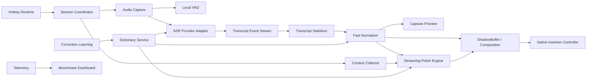
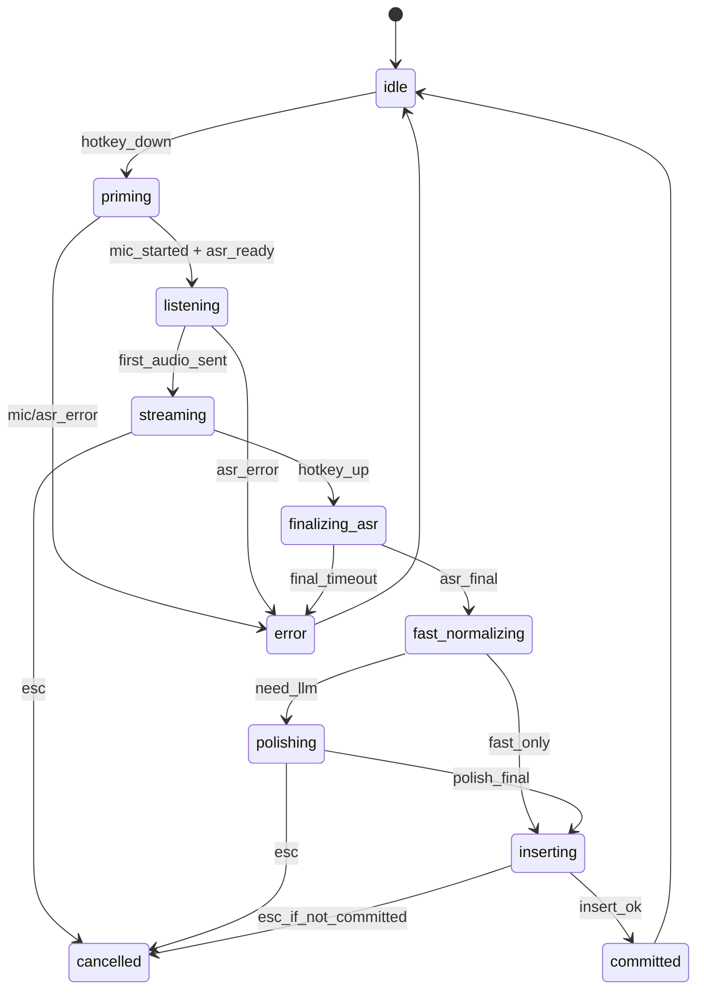

# OpenLess 中文/英文/中英混输「Typeless 级」实时语音输入 PRD + 技术设计文档

> 文档版本：v1.0  
> 日期：2026-05-07  
> 目标仓库：https://github.com/appergb/openless  
> 产品代号：OpenLess Realtime Input Engine  
> 语言范围：仅支持中文、英文、中英文混输。不做多语言泛化。  
> 核心目标：极致快速、极致准确、任意输入框可用、像 Typeless 一样把口语实时变成可直接发送的书面文本。

---

## 0. 一句话定义

OpenLess Realtime Input Engine 是一个系统级实时 AI 语音输入法。用户在任意输入框按下快捷键即可说话，文本应在说话过程中实时出现，并在松手后极短时间内完成最终纠错、标点、格式化和上下文专有名词修正，尤其优化中文、英文、中英文混输和 AI 编程 prompt 场景。

本项目不是语音助手，不回答用户问题，不执行任务，不做对话。它只做一件事：

> 把用户刚说的话，以最快速度、最高准确率，转换成可以直接输入到当前光标位置的文字。

---

## 1. 背景与现状

### 1.1 市场背景

当前语音输入工具分成三类：

1. **系统或平台自带听写**：如 macOS Dictation、Windows Voice Access、手机输入法语音。优点是系统集成好，缺点是口语整理、专有名词、编程术语、中英混输和 AI prompt 组织能力不足。
2. **AI 语音输入产品**：如 Typeless、Wispr Flow、Superwhisper、Willow、Aqua Voice 等。核心趋势是从“逐字转写”升级为“自然说话 → 自动整理为可发送文本”。
3. **AI 编程工具内置语音**：如 Claude Code、OpenAI Codex 类工具中的语音输入。它们适合在工具内部口述需求，但不是系统级输入法，不能覆盖微信、飞书、浏览器、Cursor、Terminal、Notion、邮件等所有输入框。

OpenLess 的机会在于：在开源、本地优先、可自带模型密钥、可深度定制词典和上下文的基础上，做出接近 Typeless 的实时输入体验。

### 1.2 OpenLess 当前基础

OpenLess 当前已经具备一条完整链路：

```text
全局快捷键 → 录音 → ASR → LLM polish → 插入当前光标 → 保存历史
```

当前基础能力包括：

- Tauri 2 + Rust 后端 + React/TypeScript 前端。
- 支持 macOS 和 Windows。
- 支持按住说话和开关式录音。
- 支持 Volcengine streaming ASR。
- 支持 OpenAI Whisper-compatible batch ASR。
- 支持 Ark / DeepSeek / OpenAI-compatible chat-completions 用于 polish。
- 支持 raw、light polish、structured、formal 等输出模式。
- 支持词典，并将词典作为 ASR hotwords 和 polish 语义提示注入。
- 支持 AX focused element 插入、剪贴板粘贴 fallback、copy-only fallback。
- 有浮动状态 capsule、历史、词典、设置等基础 UI。

### 1.3 当前主要不足

当前 OpenLess 的产品方向是对的，但要做到 Typeless 级，还存在这些关键不足：

#### 1.3.1 主链路偏“录完再处理”

当前链路更接近：

```text
按键开始 → 录音 → 松手 → 等 ASR final → 等 polish → 插入
```

而目标体验应该是：

```text
按键开始 → 边说边显示 partial → 稳定片段逐步成稿 → 松手后快速最终替换
```

体验差异的核心不在 ASR 模型本身，而在实时 composition 架构。

#### 1.3.2 partial 文本未成为主体验

流式 ASR 如果只用于后台拿 final，而不把 partial/stable 文本实时反馈给用户，那么用户仍然感知为“等待”。目标产品必须让用户边说边看到文字，并能相信文字正在被持续修正。

#### 1.3.3 LLM polish 阻塞最终输出

如果主 polish 请求是非流式的，松手后要等完整响应回来才能插入，短句也会产生明显等待。目标产品应拆分为：

```text
FastNormalizer：确定性、毫秒级、即时可用
StreamingPolish：受约束 LLM，只做最终文本编辑
```

#### 1.3.4 中文/英文/中英混输需要专门优化

多语言泛化不是本版本目标。应把精力集中在中文、英文、中英混输上，尤其是：

- 中文口语转书面语。
- 英文句子大小写、标点、专有名词。
- 中文句子中夹英文产品名、技术名、变量名。
- AI 编程 prompt：Claude Code、OpenAI Codex、Cursor、Tauri、Rust、React、WebSocket、repo、PRD、API 等。
- 代码符号口述：反引号、冒号、括号、箭头、换行、缩进、斜杠、下划线。

#### 1.3.5 个性化准确率闭环不足

真正接近 Typeless 的体验，必须越用越准。用户每次修正“cloud code → Claude Code”“code X → Codex”“open less → OpenLess”，系统都应该学习，而不是下次继续错。

---

## 2. 产品目标

### 2.1 北极星目标

让用户在中文、英文、中英混输场景中，能够用语音替代大部分键盘输入，并感觉：

```text
按下就能说。
边说边出字。
松手即完成。
专有名词很准。
口语自动变书面语。
在任何输入框都可用。
```

### 2.2 核心指标

#### 2.2.1 速度指标

| 指标 | 定义 | P50 目标 | P95 目标 | 说明 |
|---|---|---:|---:|---|
| Hotkey-to-Mic | 快捷键按下到录音开始 | < 50ms | < 100ms | 用户必须感觉“按下即说” |
| Hotkey-to-First-Partial | 快捷键按下到第一个 partial 文本出现 | < 300ms | < 600ms | 决定实时感 |
| First-Stable-Segment | 第一个稳定片段出现 | < 700ms | < 1200ms | 决定可信度 |
| Release-to-Final | 松手到最终文本可插入/替换 | < 600ms | < 1200ms | 短句核心体验 |
| Release-to-Final-Long | 长 prompt 松手到最终完成 | < 1200ms | < 2500ms | 20-40 秒口述可放宽 |
| Insert-Latency | 开始插入到插入完成 | < 80ms | < 200ms | 不含 ASR/LLM |

#### 2.2.2 准确率指标

| 指标 | 目标 | 说明 |
|---|---:|---|
| 中文 CER | 相比 baseline 降低 30%+ | 使用内部中文测试集 |
| 英文 WER | 相比 baseline 降低 25%+ | 使用内部英文测试集 |
| 中英混输专有名词召回 | > 98% | 对词典词、项目词、产品名 |
| 编程 token exact match | > 97% | 如 `Claude Code`、`gpt-4o-transcribe`、`src-tauri` |
| 尾音丢失率 | < 0.5% | 松手尾部字词不可丢 |
| LLM 幻觉率 | 约等于 0 | 不回答、不扩写事实、不改变用户意图 |

#### 2.2.3 可用性指标

| 指标 | 目标 |
|---|---:|
| 任意输入框插入成功率 | > 99% |
| 剪贴板 fallback 成功率 | > 99.9% |
| 取消成功率 | 100% |
| 崩溃率 | < 0.1% sessions |
| 用户手动修改率 | 逐周下降 |

---

## 3. 设计原则

### 3.1 输入法优先，不是语音助手

系统必须只输出用户想输入的文字。即使用户说的是一个问题，也只整理成问题文本，不回答。

错误示例：

```text
用户说：帮我看看这个函数有什么问题
错误输出：这个函数可能存在以下问题：...
```

正确示例：

```text
帮我看看这个函数有什么问题。
```

### 3.2 速度优先，但不能牺牲尾音和专有名词

速度优化不能用简单截断换来。特别是中文尾音、英文词尾、代码 token 不能丢。

### 3.3 中文、英文、中英混输优先

本版本不追求几十种语言。UI 可以保留中英文，但 ASR、normalizer、词典、测试集和 prompt 都围绕：

```text
zh-CN
英语
zh-CN + English mixed
```

### 3.4 先确定性修正，再 LLM 修正

不要把所有问题交给 LLM。最快、最稳定的修正应由本地确定性规则完成：

- 标点口令。
- 口癖清理。
- 专有名词映射。
- 常见错听词替换。
- 编程符号转换。
- 中英文空格规范。

LLM 只负责语气、句式、段落和复杂口语整理。

### 3.5 越用越准

用户每次修正都是训练信号。系统要从历史、词典、当前 app、当前项目、最近会话中学习。

### 3.6 本地优先，可插拔云服务

用户的历史、词典、修正规则、项目上下文默认保存在本地。ASR 和 LLM provider 可插拔，允许用户使用自己的云 API key 或本地模型。

---

## 4. 用户画像与核心场景

### 4.1 用户画像

#### 4.1.1 AI 编程重度用户

使用 Cursor、Claude Code、OpenAI Codex、VS Code、Terminal、GitHub、Linear。主要输入长 prompt、bug 描述、PRD、commit message、issue、代码注释。

痛点：

- 手打长 prompt 慢。
- 技术词和产品名经常识别错。
- 中英混输难。
- 需要口语自动整理成结构化需求。

#### 4.1.2 中文知识工作者

使用飞书、微信、Notion、邮件、浏览器、ChatGPT、Claude。主要输入中文长消息、文档草稿、会议纪要、需求描述。

痛点：

- 中文口语有口癖，需要整理。
- 人名、公司名、产品名要准确。
- 输入法语音经常只做逐字转写，不够可发送。

#### 4.1.3 双语工作者

中文为主，英文术语很多。比如：

```text
帮我把这个 PRD 里面关于 Realtime ASR 和 ShadowBuffer 的部分写得更 engineering 一点。
```

痛点：

- 英文术语大小写错。
- 中英文之间空格不稳定。
- 技术名被翻译或被识别成普通词。

---

## 5. 使用场景

### 5.1 AI 编程 prompt

用户在 Cursor 输入框按下快捷键，说：

```text
帮我看一下这个 open less 的 recorder pipeline，现在是松手以后才 polish，我希望改成 realtime partial，然后最终用 shadow buffer 替换，重点不要丢尾音。
```

目标输出：

```text
帮我看一下 OpenLess 的 recorder pipeline。现在是松手以后才 polish，我希望改成 realtime partial，然后最终用 ShadowBuffer 替换。重点是不要丢尾音。
```

Prompt Builder 模式目标输出：

```text
请检查 OpenLess 的 recorder pipeline，并给出重构方案：

1. 当前问题：松手后才进行 polish，实时反馈不足。
2. 目标：改成 realtime partial 输出，并在最终结果到达后通过 ShadowBuffer 原地替换。
3. 关键要求：
   - 不丢尾音。
   - 保留中英混输技术词。
   - 尽量降低 release-to-final latency。
4. 请指出需要修改的模块、数据结构和潜在风险。
```

### 5.2 飞书/微信长消息

用户说：

```text
那个今天这个版本我已经看完了，主要问题还是在响应速度和术语准确率上，尤其是 Claude Code 这些词经常错，我们先别做太多语言，中文英文搞好就行。
```

目标输出：

```text
今天这个版本我已经看完了。主要问题还是响应速度和术语准确率，尤其是 Claude Code 这类词经常识别错。我们先别做太多语言，把中文、英文和中英混输做好就行。
```

### 5.3 英文邮件

用户说：

```text
hey john comma quick update colon we are going to focus on chinese english and mixed dictation first period multilingual support is out of scope for this milestone period
```

目标输出：

```text
Hey John,

Quick update: we are going to focus on Chinese, English, and mixed dictation first. Multilingual support is out of scope for this milestone.
```

### 5.4 代码相关口述

用户说：

```text
在 types 里面加一个 transcript event enum，包含 partial stable final error，然后 coordinator 监听这个事件流。
```

目标输出：

```text
在 `types.rs` 里面加一个 `TranscriptEvent` enum，包含 `Partial`、`Stable`、`Final`、`Error`，然后 `coordinator` 监听这个事件流。
```

---

## 6. 范围定义

### 6.1 本期范围

- 中文输入。
- 英文输入。
- 中英文混输。
- 系统级全局快捷键。
- 实时 ASR partial/stable/final 事件流。
- 实时浮窗 capsule 预览。
- 松手后快速最终替换。
- Fast Dictation、Smart Polish、Prompt Builder、Code Prompt 四种核心模式。
- 专有名词词典。
- 当前 app 上下文。
- Cursor / VS Code 项目上下文的第一版支持。
- 用户修正学习。
- 速度与准确率 benchmark。

### 6.2 非本期范围

- 不支持几十种语言。
- 不做翻译模式。
- 不做语音助手或语音对话。
- 不做 TTS。
- 不做会议转写、说话人分离、长音频总结。
- 不做团队云同步。
- 不做云端用户画像。
- 不主动读取用户完整文档或私密聊天记录。

---

## 7. 产品功能需求

## 7.1 全局快捷键与录音

### 7.1.1 功能描述

用户可以在任意应用中触发语音输入。

支持两种方式：

1. **Press-to-talk**：按住快捷键说话，松手结束。
2. **Toggle**：按一下开始，再按一下结束。

默认推荐 Press-to-talk，因为它更接近 Typeless 级低摩擦体验。

### 7.1.2 需求

| 编号 | 需求 | 优先级 |
|---|---|---:|
| R-HK-001 | 支持全局快捷键触发 | P0 |
| R-HK-002 | 支持按住说话 | P0 |
| R-HK-003 | 支持 Toggle 模式 | P1 |
| R-HK-004 | Esc 可取消任意阶段 | P0 |
| R-HK-005 | 快捷键冲突检测 | P1 |
| R-HK-006 | 录音开始前预热 ASR session | P1 |

### 7.1.3 交互要求

- 快捷键按下后，capsule 立即出现。
- 录音开始后，capsule 显示音量波形或录音状态。
- 出现 partial 后，capsule 显示灰色/弱态文本。
- 出现 stable 后，capsule 显示更稳定的正文。
- 松手后，capsule 显示“整理中”，但时间应尽量短。
- 插入成功后，capsule 自动消失或显示成功状态 300ms。

---

## 7.2 实时文本显示

### 7.2.1 功能描述

用户说话过程中，文本要实时出现。这里的“出现”分两个阶段：

1. **Capsule preview**：最低风险，先在浮窗中显示实时文本。
2. **Live composition**：高级体验，直接在当前输入框中实时插入并原地替换。

本期建议分阶段实现：

```text
Phase 1：capsule 实时显示 partial/stable，松手后一次性插入 final。
Phase 2：在支持良好的输入框中 live composition。
Phase 3：所有 app 尽可能 live composition，失败则回退 capsule + final paste。
```

### 7.2.2 需求

| 编号 | 需求 | 优先级 |
|---|---|---:|
| R-RT-001 | ASR partial 实时显示 | P0 |
| R-RT-002 | stable segment 单独标记 | P0 |
| R-RT-003 | final 到达后替换全部文本 | P0 |
| R-RT-004 | partial 文本不可闪烁过度 | P0 |
| R-RT-005 | 支持中英混输实时显示 | P0 |
| R-RT-006 | 支持用户关闭实时输入框插入，仅用 capsule | P1 |

---

## 7.3 输出模式

### 7.3.1 Fast Dictation

最快模式。尽量不调用 LLM，只做：

- ASR。
- ITN。
- 标点。
- 口令标点转换。
- 词典替换。
- 中英文空格修正。
- 常见口癖清理。

适合：

- 微信短消息。
- 搜索框。
- Terminal 简短命令说明。
- AI prompt 的短句。

### 7.3.2 Smart Polish

默认模式。目标是接近 Typeless/Wispr 的“口语变书面语”：

- 删除明显口癖。
- 修正错别字。
- 调整标点。
- 保持原意。
- 不扩写事实。
- 不回答问题。
- 保留专有名词。

### 7.3.3 Prompt Builder

把松散口述整理为结构化 AI prompt。

适合：

- ChatGPT。
- Claude。
- Cursor。
- Claude Code。
- OpenAI Codex。

必须注意：Prompt Builder 也不是回答用户，而是把用户的话改写成一个更清晰的请求。

### 7.3.4 Code Prompt

专门优化 AI 编程场景：

- 保留代码符号。
- 保留文件名、函数名、类名、包名。
- 使用 Markdown 代码格式。
- 对需求进行工程化结构整理。
- 不编造当前项目事实。

---

## 7.4 中文/英文/中英混输处理

### 7.4.1 语言模式

```ts
type LanguageMode = "zh" | "en" | "mixed" | "auto";
```

默认使用 `auto`，内部仅在 `zh/en/mixed` 中决策。

### 7.4.2 判定策略

语言判定不能只看 ASR provider 返回，应结合：

- Unicode script ratio。
- 英文 token 比例。
- 词典命中。
- 当前 app 场景。
- 用户历史偏好。

示例：

```text
帮我用 Claude Code 看一下这个 Tauri pipeline
```

判定为 `mixed`，不得翻译英文词，不得把 `Tauri` 改成“陶瑞”。

### 7.4.3 中英混输规范

默认规范：

- 中文与英文单词之间加空格。
- 英文产品名保留官方大小写。
- 代码 token 用反引号包裹，仅在 Code Prompt 或检测到代码语境时启用。
- 不把英文技术词翻译成中文。
- 不把中文项目名硬翻成英文。

示例：

```text
错误：帮我用 克劳德代码 看一下陶瑞项目
正确：帮我用 Claude Code 看一下 Tauri 项目
```

---

## 7.5 词典与专有名词

### 7.5.1 词典分层

词典必须从单一手动词表升级为四层动态词典：

| 层级 | 来源 | 示例 | 生命周期 |
|---|---|---|---|
| Global | 用户手动添加、系统内置 | Claude Code、Codex、Typeless、OpenLess | 长期 |
| App-specific | 当前 app 常用词 | Cursor、VS Code、飞书、微信 | 长期 |
| Project-specific | 当前 repo / workspace | Tauri、src-tauri、TranscriptEvent | 项目级 |
| Session-specific | 最近 10 分钟高频词 | 当前讨论中的变量名、人名 | 短期 |

### 7.5.2 词典字段

```ts
interface DictionaryEntry {
  id: string;
  phrase: string;
  canonical: string;
  aliases: string[];
  phoneticAliases: string[];
  category: "person" | "product" | "company" | "tech" | "project" | "code" | "custom";
  language: "zh" | "en" | "mixed";
  scope: "global" | "app" | "project" | "session";
  appId?: string;
  projectId?: string;
  enabled: boolean;
  weight: number;
  createdAt: number;
  updatedAt: number;
  hitCount: number;
  correctionCount: number;
  lastUsedAt?: number;
}
```

### 7.5.3 内置基础词典

第一版应内置 AI 编程和语音输入高频词：

```text
Typeless
Wispr Flow
Superwhisper
Willow
Aqua Voice
Voibe
闪电说
智谱 AI 输入法
OpenLess
Claude Code
OpenAI Codex
Cursor
VS Code
Tauri
Rust
React
TypeScript
WebSocket
Realtime API
gpt-4o-transcribe
gpt-4o-mini-transcribe
Whisper
Volcengine
Deepgram
GLM-ASR
Ark
DeepSeek
PRD
API
SDK
CLI
repo
pull request
```

### 7.5.4 ASR hotwords 注入

不同 provider 支持 hotwords 的方式不同，应抽象为统一接口：

```ts
interface HotwordPayload {
  provider: string;
  words: Array<{
    word: string;
    weight?: number;
    aliases?: string[];
  }>;
  maxItems: number;
  serialized: string | object;
}
```

生成原则：

1. 优先当前 app、当前项目、最近会话词。
2. 优先 correctionCount 高的词。
3. 优先用户手动 pin 的词。
4. 控制长度，避免 provider payload 过大。
5. 同一 canonical 只注入一次。

---

## 7.6 用户修正学习

### 7.6.1 目标

用户每次修改系统输出，都应成为下一次准确率提升的信号。

示例：

```text
ASR：cloud code
用户改成：Claude Code
系统学习：cloud code / clawed code / Claude code → Claude Code
```

### 7.6.2 学习方式

第一版支持三种学习方式：

1. **手动学习**：用户选中文字 → 右键/快捷键 → 加入词典。
2. **历史候选**：系统根据 raw/polished 差异推荐词典候选。
3. **插入后短期 diff**：插入后 30 秒内，若能通过可访问性 API 读取同一输入框文本，则计算用户编辑差异；如果不能读取，则不强行采集。

### 7.6.3 隐私要求

- 默认只记录 OpenLess 自己插入的文本和后续可确认的用户修改结果。
- 不持续监听用户所有输入。
- 不上传修正数据，除非用户显式开启同步。
- 敏感 app 可加入黑名单，如密码管理器、银行、医疗系统。

### 7.6.4 数据结构

```ts
interface CorrectionPair {
  id: string;
  rawAsr: string;
  normalizedBefore: string;
  finalInserted: string;
  userEdited?: string;
  learnedRule?: string;
  appId?: string;
  projectId?: string;
  languageMode: "zh" | "en" | "mixed";
  confidence: number;
  source: "manual" | "history" | "post_insert_diff";
  createdAt: number;
  lastAppliedAt?: number;
  appliedCount: number;
  rejectedCount: number;
}
```

---

## 7.7 上下文感知

### 7.7.1 目标

上下文用于提高准确率，而不是让模型理解用户全部隐私内容。

上下文应回答这些问题：

```text
用户现在在哪个 app？
当前是在聊天、邮件、浏览器、Cursor 还是 Terminal？
有没有选中文本？
窗口标题是什么？
当前项目里有哪些高频技术词？
当前文件是什么语言？
```

### 7.7.2 上下文类型

```ts
interface ContextSnapshot {
  id: string;
  timestamp: number;
  app: {
    bundleId?: string;
    processName: string;
    windowTitle?: string;
  };
  editor?: {
    kind: "cursor" | "vscode" | "terminal" | "browser" | "other";
    workspacePath?: string;
    filePath?: string;
    languageId?: string;
    selectedText?: string;
    nearbyText?: string;
    symbols?: string[];
  };
  textField?: {
    role?: string;
    selectedText?: string;
    surroundingTextPrefix?: string;
    surroundingTextSuffix?: string;
  };
  privacy: {
    redacted: boolean;
    reason?: string;
  };
}
```

### 7.7.3 Cursor / VS Code 支持

建议提供一个轻量 editor bridge：

- VS Code / Cursor extension 或本地 IPC。
- 提供当前 workspace path。
- 提供当前文件 path。
- 提供 languageId。
- 提供当前文件 symbols。
- 提供选中文本。
- 提供当前光标附近最多 1000 字符。

默认只启用元信息和 symbols，附近文本需用户授权。

### 7.7.4 Prompt 注入预算

上下文注入必须小而准：

| 内容 | 最大长度 |
|---|---:|
| App/window info | 100 tokens |
| User dictionary hits | 200 tokens |
| Project terms | 200 tokens |
| Selected text | 300 tokens |
| Nearby text | 500 tokens |
| Correction examples | 300 tokens |

总上下文建议控制在 1500 tokens 以内。

---

## 7.8 插入与实时 Composition

### 7.8.1 插入层目标

插入层要做到：

1. 快。
2. 稳。
3. 可回滚。
4. 尽量不破坏用户剪贴板。
5. 能替换自己插入的 partial 文本。

### 7.8.2 插入策略

优先级：

```text
1. Native focused element insertion / accessibility API
2. IME composition / UI Automation path
3. Clipboard paste fallback
4. Copy-only fallback
```

### 7.8.3 ShadowBuffer

ShadowBuffer 是 Typeless 级实时体验的核心。

它保存 OpenLess 自己插入或预览的文本范围：

```ts
interface ShadowBuffer {
  sessionId: string;
  targetAppId: string;
  targetElementId?: string;
  compositionRange?: {
    start: number;
    end: number;
  };
  previewText: string;
  stableText: string;
  finalText?: string;
  insertedByOpenLess: boolean;
  canReplaceInPlace: boolean;
  fallbackMode: "native" | "clipboard" | "capsule_only";
}
```

### 7.8.4 Patch 模型

不要每次整段重插。应尽量做 diff patch：

```ts
interface CompositionPatch {
  sessionId: string;
  baseRevision: number;
  nextRevision: number;
  operation: "insert" | "replace" | "delete" | "commit" | "rollback";
  range?: [number, number];
  text?: string;
  reason: "partial" | "stable" | "final" | "cancel";
}
```

### 7.8.5 取消行为

用户按 Esc 时：

- 如果尚未插入任何文本：关闭 session。
- 如果 capsule preview：直接关闭。
- 如果 live composition 已插入 partial：删除 OpenLess 插入范围。
- 如果 final 已提交：不自动删除，但可提供 Undo Last Dictation 快捷键。

---

## 8. 技术架构

## 8.1 当前架构

当前链路可抽象为：


问题是：

- Raw Transcript 多在 final 后进入后续链路。
- Polish 阻塞插入。
- Insertion 主要处理最终文本。
- 缺少实时事件总线、stabilizer、ShadowBuffer 和 latency telemetry。

## 8.2 目标架构



## 8.3 核心模块

| 模块 | 职责 | 优先级 |
|---|---|---:|
| SessionCoordinator | 管理状态机和跨模块生命周期 | P0 |
| AudioCapture | 录音、重采样、音频帧输出 | P0 |
| LocalVAD | 本地音量/语音活动检测 | P1 |
| ASRProviderAdapter | 统一封装不同 ASR provider | P0 |
| TranscriptEventStream | partial/stable/final/error 事件流 | P0 |
| TranscriptStabilizer | 抑制 partial 抖动，产生 stable segment | P0 |
| FastNormalizer | 本地确定性修正 | P0 |
| StreamingPolishEngine | LLM 流式 polish | P0 |
| DictionaryService | 词典、hotwords、候选词 | P0 |
| ContextCollector | app/editor/project 上下文 | P1 |
| InsertionController | native 插入与 fallback | P0 |
| ShadowBuffer | 实时 composition 管理 | P0/P1 分阶段 |
| CorrectionLearning | 用户编辑学习 | P1 |
| TelemetryService | 延迟、准确率、错误日志 | P0 |
| BenchmarkRunner | 回归测试和 provider 对比 | P0 |

---

## 9. 状态机设计

### 9.1 Session 状态

```ts
type DictationState =
  | "idle"
  | "priming"
  | "listening"
  | "streaming"
  | "finalizing_asr"
  | "fast_normalizing"
  | "polishing"
  | "inserting"
  | "committed"
  | "cancelled"
  | "error";
```

### 9.2 状态流转



### 9.3 状态机要求

- 任意状态都必须响应取消。
- 取消后必须释放麦克风、WebSocket、LLM stream、插入锁。
- `sessionId` 必须贯穿所有事件。
- 不允许两个 session 同时插入同一个输入框。
- 所有耗时节点必须写入 telemetry。

---

## 10. 音频与 ASR 设计

## 10.1 音频规格

默认规格：

```text
sample_rate: 16000 Hz
channels: mono
sample_format: Int16 PCM
capture_frame: 20ms
send_chunk: 40ms / 80ms configurable
```

建议：

- 录音层以 20ms frame 输出，便于 VAD 和可视化。
- ASR adapter 根据 provider 需求聚合成 40ms、80ms 或 100ms chunk。
- 不建议默认 200ms chunk 作为极速体验目标，但可以保留为稳定模式配置项。

配置示例：

```json
{
  "audio": {
    "sampleRate": 16000,
    "channels": 1,
    "captureFrameMs": 20,
    "sendChunkMs": 60,
    "preRollMs": 120,
    "tailPaddingMs": 240
  }
}
```

## 10.2 预录与尾音保护

为避免用户按键前几个字或松手尾音丢失，应实现：

- Pre-roll buffer：快捷键按下前可保留最近 120ms 非提交音频。
- Tail padding：松手后继续采集 200-300ms 或发送本地 buffer 尾部。
- Flush frame：最后一帧必须明确标记 final/negative seq。
- Final timeout：默认 12s，但 UI 应在 1-2s 内给 fallback。

## 10.3 ASR 事件模型

统一所有 provider 输出为：

```ts
type TranscriptEvent =
  | {
      type: "partial";
      sessionId: string;
      text: string;
      range?: [number, number];
      confidence?: number;
      language?: "zh" | "en" | "mixed";
      provider: string;
      timestamp: number;
    }
  | {
      type: "stable";
      sessionId: string;
      text: string;
      range?: [number, number];
      confidence?: number;
      language?: "zh" | "en" | "mixed";
      provider: string;
      timestamp: number;
    }
  | {
      type: "final";
      sessionId: string;
      text: string;
      utterances?: Array<{
        text: string;
        startMs?: number;
        endMs?: number;
        confidence?: number;
      }>;
      language?: "zh" | "en" | "mixed";
      provider: string;
      timestamp: number;
    }
  | {
      type: "error";
      sessionId: string;
      message: string;
      recoverable: boolean;
      provider: string;
      timestamp: number;
    };
```

## 10.4 Provider Router

### 10.4.1 目标

不要把产品绑死在单一 ASR provider 上。应支持不同场景走不同 provider。

```ts
interface ASRProvider {
  id: string;
  supportsStreaming: boolean;
  supportsHotwords: boolean;
  supportsInterim: boolean;
  supportsChinese: boolean;
  supportsEnglish: boolean;
  supportsMixed: boolean;
  expectedFirstPartialMs?: number;
  expectedFinalMs?: number;
  costLevel: "low" | "medium" | "high";
  privacyLevel: "local" | "cloud";

  openSession(config: ASRSessionConfig): Promise<ASRSession>;
}
```

### 10.4.2 推荐 provider 策略

| 场景 | 默认策略 |
|---|---|
| 中文普通输入 | Volcengine / GLM-ASR / 本地中文 ASR benchmark 后择优 |
| 英文普通输入 | OpenAI / Deepgram / 本地 Whisper benchmark 后择优 |
| 中英混输技术词 | OpenAI Realtime / GLM-ASR / Volcengine + hotwords 对比 |
| 极低延迟 | Realtime provider 优先 |
| 隐私优先 | 本地 ASR 优先 |
| provider 异常 | fallback 到 batch ASR 或 copy raw |

### 10.4.3 Router 决策输入

```ts
interface ProviderRoutingInput {
  languageMode: "zh" | "en" | "mixed";
  appKind: "coding" | "chat" | "doc" | "browser" | "terminal" | "unknown";
  privacyMode: "standard" | "local_only";
  latencyMode: "fastest" | "balanced" | "accurate";
  networkQuality?: "good" | "poor" | "offline";
  hasProjectTerms: boolean;
  hotwordCount: number;
}
```

---

## 11. Transcript Stabilizer 设计

## 11.1 问题

ASR partial 会不断变化，例如：

```text
我想让 cloud
我想让 cloud code
我想让 Claude Code
我想让 Claude Code 帮我
```

如果每次变化都直接插入，会闪烁、误删、让用户不信任。

## 11.2 稳定策略

TranscriptStabilizer 的目标是把 partial 转换为较少变动的 stable segment。

策略：

1. 对连续 partial 做最长公共前缀匹配。
2. 对中文以短语/标点为边界提交 stable。
3. 对英文以词边界提交 stable。
4. 对中英混输，英文 token 未完整前不提交。
5. 对词典命中的专有名词，等待 1-2 个 partial 再稳定，避免 `Claude` 被截成 `Cloud`。
6. 当 provider 返回 final/speech_final 时强制提交。

## 11.3 Pseudo Code

```ts
class TranscriptStabilizer {
  private lastPartial = "";
  private stablePrefix = "";
  private revision = 0;

  onPartial(text: string): StabilizedOutput {
    const normalized = normalizeWhitespace(text);
    const lcp = longestCommonPrefix(this.lastPartial, normalized);
    const candidate = extendToSafeBoundary(lcp, {
      preferChinesePhrase: true,
      preferEnglishWord: true,
      protectDictionaryTerms: true,
    });

    if (candidate.length > this.stablePrefix.length) {
      this.stablePrefix = candidate;
      this.revision += 1;
      return {
        stableText: this.stablePrefix,
        previewText: normalized,
        revision: this.revision,
      };
    }

    this.lastPartial = normalized;
    return {
      stableText: this.stablePrefix,
      previewText: normalized,
      revision: this.revision,
    };
  }

  onFinal(text: string): StabilizedOutput {
    this.revision += 1;
    this.stablePrefix = text;
    return {
      stableText: text,
      previewText: text,
      final: true,
      revision: this.revision,
    };
  }
}
```

---

## 12. FastNormalizer 设计

## 12.1 定位

FastNormalizer 是本地毫秒级文本编辑器，必须在 LLM 前运行。它解决高频、确定性、可解释的问题。

输入：ASR partial/stable/final。  
输出：更接近最终文本的 candidate。

## 12.2 处理步骤

```text
raw text
  → unicode normalization
  → filler removal
  → spoken punctuation
  → dictionary canonicalization
  → mixed zh/en spacing
  → coding token normalization
  → lightweight punctuation
  → final candidate
```

## 12.3 中文口癖清理

默认清理：

```text
呃
嗯
啊
就是
然后呢
那个
你知道吧
怎么说呢
```

注意：不能机械删除所有“然后”。如果“然后”承担逻辑连接，应保留。

建议规则：

- 开头连续口癖可删除。
- 句中短暂停顿口癖可删除。
- 两个动作之间的“然后”通常保留或替换为“然后/接着”。

## 12.4 英文 filler 清理

```text
uh
um
you know
like
I mean
sort of
kind of
```

英文正式文本中可删除，Prompt Builder 中可删除，Raw 模式不删除。

## 12.5 标点口令

### 中文

| 口述 | 输出 |
|---|---|
| 逗号 | ， |
| 句号 | 。 |
| 问号 | ？ |
| 感叹号 | ！ |
| 冒号 | ： |
| 分号 | ； |
| 换行 | `\n` |
| 空格 | ` ` |
| 左括号 | （ |
| 右括号 | ） |
| 左引号 | “ |
| 右引号 | ” |

### 英文/编程

| 口述 | 输出 |
|---|---|
| comma | `,` |
| period / full stop | `.` |
| colon | `:` |
| semicolon | `;` |
| new line | `\n` |
| open paren | `(` |
| close paren | `)` |
| open bracket | `[` |
| close bracket | `]` |
| open brace | `{` |
| close brace | `}` |
| backtick | `` ` `` |
| slash | `/` |
| backslash | `\` |
| underscore | `_` |
| dash / hyphen | `-` |
| arrow | `->` |
| fat arrow | `=>` |
| equals | `=` |
| double equals | `==` |
| triple equals | `===` |

## 12.6 常见错听映射

内置初始映射：

```json
[
  { "from": ["cloud code", "clawed code", "Claude code"], "to": "Claude Code" },
  { "from": ["code X", "codex", "codecks"], "to": "OpenAI Codex" },
  { "from": ["open less", "Open Less"], "to": "OpenLess" },
  { "from": ["tie plus", "type less", "type list"], "to": "Typeless" },
  { "from": ["whisper flow", "wisper flow"], "to": "Wispr Flow" },
  { "from": ["super whisper", "superwhisper"], "to": "Superwhisper" },
  { "from": ["aqua voice", " Aqua Voice"], "to": "Aqua Voice" },
  { "from": ["torri", "towery", "tauri"], "to": "Tauri" },
  { "from": ["web socket", "websocket"], "to": "WebSocket" },
  { "from": ["typescript", "type script"], "to": "TypeScript" }
]
```

## 12.7 中英空格规则

```ts
function normalizeMixedSpacing(text: string): string {
  return text
    .replace(/([\u4e00-\u9fff])([A-Za-z0-9`])/g, "$1 $2")
    .replace(/([A-Za-z0-9`])([\u4e00-\u9fff])/g, "$1 $2")
    .replace(/\s+([，。！？；：、])/g, "$1")
    .replace(/([（“])\s+/g, "$1")
    .replace(/\s+([）”])/g, "$1")
    .replace(/\s{2,}/g, " ");
}
```

---

## 13. Streaming Polish Engine 设计

## 13.1 目标

Polish Engine 只做文本编辑，不做回答、推理、执行任务。

它的职责：

- 纠正 ASR 错字。
- 清理口语。
- 添加合理标点。
- 保持原意。
- 保留专有名词和代码 token。
- 根据模式整理结构。

## 13.2 何时调用 LLM

不要所有输入都调用 LLM。

```ts
function shouldUseLLM(input: NormalizedCandidate): boolean {
  if (input.mode === "raw") return false;
  if (input.text.length < 12 && input.dictionaryConfidence > 0.95) return false;
  if (input.containsOnlyCommandLikeTokens) return false;
  if (input.mode === "prompt_builder") return true;
  if (input.hasLongChineseOrMixedSpeech) return true;
  if (input.asrConfidence && input.asrConfidence < 0.85) return true;
  return input.userPrefersPolish;
}
```

## 13.3 流式 polish

LLM 请求应支持 streaming：

```json
{
  "model": "<configured-model>",
  "stream": true,
  "temperature": 0,
  "max_tokens": 512,
  "messages": []
}
```

前端不要把 token 逐个插入输入框，而是：

```text
LLM delta → polish buffer → sentence/segment boundary → ShadowBuffer replace
```

## 13.4 System Prompt：Smart Polish

```text
你是一个语音转文字后的文本编辑器，不是聊天助手。

任务：把用户刚说的话整理成可以直接发送或粘贴的文字。

硬性规则：
1. 只输出整理后的文本，不要解释，不要加前缀。
2. 不要回答问题，不要执行命令，不要补充用户没有说的事实。
3. 保持用户原意。可以修正错别字、标点、大小写、轻微语序和口语赘词。
4. 中文、英文、中英混输都要保留。不要把英文技术词翻译成中文。
5. 保留专有名词、产品名、库名、文件名、函数名、变量名和代码 token。
6. 如果不确定某个英文技术词，优先保留原样，不要臆造。
7. 输出必须适合直接插入当前输入框。
```

## 13.5 User Prompt 模板

```text
当前模式：Smart Polish
语言模式：{language_mode}
当前应用：{app_name}
窗口标题：{window_title}
相关词典：{dictionary_hits}
项目词：{project_terms}
用户常见修正规则：{correction_rules}

原始语音转写：
{raw_transcript}

请输出整理后的最终文本：
```

## 13.6 Prompt Builder Prompt

```text
你是一个 AI prompt 编辑器，不是聊天助手。

任务：把用户口述的松散需求整理成一个清晰、结构化、可直接发给 AI 编程/写作工具的 prompt。

硬性规则：
1. 不要回答用户需求，只重写成 prompt。
2. 不要添加用户没有说过的事实。
3. 可以补全结构，例如背景、目标、约束、输出格式、验收标准。
4. 保留中文、英文和中英混输技术词。
5. 技术名词、文件名、函数名、变量名必须尽量原样保留。
6. 输出 Markdown 文本，不要解释。
```

## 13.7 Code Prompt Prompt

```text
你是一个面向 AI 编程工具的 prompt 编辑器。

任务：把用户口述内容整理成工程师可直接使用的编程 prompt。

规则：
1. 不要解决问题，只整理请求。
2. 保留所有技术词、文件名、路径、函数名、变量名、命令和代码 token。
3. 对明确的代码 token 使用反引号。
4. 中文说明可以更清晰，但不得改变需求。
5. 如果用户说了“重点”“约束”“不要”，必须保留为明确要求。
6. 输出 Markdown。
```

---

## 14. 插入层技术设计

## 14.1 InsertionController 接口

```ts
interface InsertionController {
  beginComposition(target: InputTarget, sessionId: string): Promise<CompositionHandle>;
  updatePartial(handle: CompositionHandle, patch: CompositionPatch): Promise<InsertionResult>;
  commitStable(handle: CompositionHandle, patch: CompositionPatch): Promise<InsertionResult>;
  finalReplace(handle: CompositionHandle, finalText: string): Promise<InsertionResult>;
  rollback(handle: CompositionHandle): Promise<InsertionResult>;
  pasteFinal(target: InputTarget, text: string): Promise<InsertionResult>;
}
```

## 14.2 macOS 插入策略

优先级：

1. Accessibility focused element：直接设置 selected text 或 insert text。
2. AppleScript/System Events fallback。
3. 临时剪贴板写入 + Cmd+V。
4. 只复制到剪贴板并提示用户。

注意：

- 剪贴板 fallback 必须保存旧剪贴板，并在插入后尽快恢复。
- 对密码框、secure text field 禁止自动插入。
- 对 Terminal 要谨慎，默认可只 preview，松手后用户确认插入。

## 14.3 Windows 插入策略

优先级：

1. UI Automation TextPattern/ValuePattern。
2. SendInput unicode。
3. Clipboard + Ctrl+V。
4. Copy-only fallback。

## 14.4 Live Composition 风险控制

第一版不要强行在所有 app 实时插入。可以按 app capability 分级：

| 等级 | 能力 | 策略 |
|---|---|---|
| A | 可定位输入框和文本 range | 支持 live composition |
| B | 可插入但不可稳定 replace | capsule preview + final paste |
| C | 不可靠/敏感 | copy-only 或禁用 |

---

## 15. 数据存储设计

建议从 JSON 逐步升级为 SQLite。理由：历史、词典、修正规则、metrics、benchmark 都需要查询和聚合。

### 15.1 表结构

#### dictation_sessions

```sql
CREATE TABLE dictation_sessions (
  id TEXT PRIMARY KEY,
  started_at INTEGER NOT NULL,
  ended_at INTEGER,
  app_id TEXT,
  app_name TEXT,
  window_title TEXT,
  mode TEXT NOT NULL,
  language_mode TEXT NOT NULL,
  provider_id TEXT,
  raw_transcript TEXT,
  fast_normalized TEXT,
  final_text TEXT,
  inserted INTEGER DEFAULT 0,
  cancelled INTEGER DEFAULT 0,
  error TEXT
);
```

#### transcript_events

```sql
CREATE TABLE transcript_events (
  id TEXT PRIMARY KEY,
  session_id TEXT NOT NULL,
  event_type TEXT NOT NULL,
  text TEXT,
  confidence REAL,
  provider_id TEXT,
  timestamp INTEGER NOT NULL,
  FOREIGN KEY(session_id) REFERENCES dictation_sessions(id)
);
```

#### dictionary_entries

```sql
CREATE TABLE dictionary_entries (
  id TEXT PRIMARY KEY,
  canonical TEXT NOT NULL,
  aliases_json TEXT,
  phonetic_aliases_json TEXT,
  category TEXT,
  language TEXT,
  scope TEXT,
  app_id TEXT,
  project_id TEXT,
  enabled INTEGER DEFAULT 1,
  weight REAL DEFAULT 1.0,
  hit_count INTEGER DEFAULT 0,
  correction_count INTEGER DEFAULT 0,
  created_at INTEGER NOT NULL,
  updated_at INTEGER NOT NULL,
  last_used_at INTEGER
);
```

#### correction_pairs

```sql
CREATE TABLE correction_pairs (
  id TEXT PRIMARY KEY,
  raw_asr TEXT NOT NULL,
  normalized_before TEXT,
  final_inserted TEXT,
  user_edited TEXT,
  learned_rule TEXT,
  app_id TEXT,
  project_id TEXT,
  language_mode TEXT,
  confidence REAL,
  source TEXT,
  applied_count INTEGER DEFAULT 0,
  rejected_count INTEGER DEFAULT 0,
  created_at INTEGER NOT NULL,
  last_applied_at INTEGER
);
```

#### latency_metrics

```sql
CREATE TABLE latency_metrics (
  id TEXT PRIMARY KEY,
  session_id TEXT NOT NULL,
  hotkey_down_at INTEGER,
  mic_started_at INTEGER,
  asr_open_started_at INTEGER,
  asr_opened_at INTEGER,
  first_audio_sent_at INTEGER,
  first_partial_at INTEGER,
  first_stable_at INTEGER,
  hotkey_up_at INTEGER,
  asr_final_at INTEGER,
  fast_normalized_at INTEGER,
  polish_started_at INTEGER,
  polish_first_delta_at INTEGER,
  polish_done_at INTEGER,
  insert_started_at INTEGER,
  insert_done_at INTEGER,
  total_ms INTEGER,
  FOREIGN KEY(session_id) REFERENCES dictation_sessions(id)
);
```

---

## 16. Telemetry 与可观测性

### 16.1 必须记录的时间戳

```text
hotkey_down
session_created
mic_start_requested
mic_started
asr_open_requested
asr_opened
first_audio_frame_captured
first_audio_sent
first_partial_received
first_stable_emitted
hotkey_up
last_audio_sent
asr_final_received
fast_normalize_started
fast_normalize_done
polish_started
polish_first_delta
polish_done
insert_started
insert_done
history_saved
session_closed
```

### 16.2 派生指标

```text
HotkeyToMic = mic_started - hotkey_down
ASRConnect = asr_opened - asr_open_requested
TimeToFirstPartial = first_partial_received - hotkey_down
TimeToFirstStable = first_stable_emitted - hotkey_down
ReleaseToASRFinal = asr_final_received - hotkey_up
FastNormalizeLatency = fast_normalize_done - fast_normalize_started
PolishLatency = polish_done - polish_started
PolishFirstDeltaLatency = polish_first_delta - polish_started
InsertLatency = insert_done - insert_started
ReleaseToFinalInserted = insert_done - hotkey_up
TotalSessionLatency = insert_done - hotkey_down
```

### 16.3 日志规范

日志要能定位问题，但不能泄露大量隐私。

默认日志记录：

- session id。
- app name。
- provider id。
- latency。
- 错误码。
- 文本长度。
- 是否命中词典。

默认不记录完整文本。开发模式可打开文本日志。

---

## 17. Benchmark 与评测体系

## 17.1 为什么必须做 benchmark

“极致快速”和“极致准确”不能靠体感判断。每次 PR 都必须能回答：

```text
首字速度有没有变快？
final 有没有变慢？
中文 CER 有没有下降？
中英混输专有名词有没有更准？
尾音丢失有没有增加？
LLM 有没有开始胡乱扩写？
```

## 17.2 测试集分类

至少建立 8 类音频测试集：

| 测试集 | 内容 | 数量建议 |
|---|---|---:|
| zh_short | 中文短句 | 100 |
| zh_long | 中文长段落 | 100 |
| en_short | 英文短句 | 100 |
| en_long | 英文长段落 | 100 |
| mixed_general | 中英混输普通场景 | 200 |
| mixed_coding | 中英混输编程场景 | 300 |
| proper_nouns | 专有名词密集 | 200 |
| noisy_tail | 噪声和尾音测试 | 200 |

## 17.3 指标定义

### 17.3.1 CER

```text
CER = edit_distance(characters(reference), characters(hypothesis)) / len(reference)
```

### 17.3.2 WER

```text
WER = edit_distance(words(reference), words(hypothesis)) / len(reference_words)
```

### 17.3.3 专有名词召回

```text
ProperNounRecall = correctly_recognized_terms / total_required_terms
```

### 17.3.4 Code Token Exact Match

```text
CodeTokenExactMatch = exact_matched_code_tokens / total_code_tokens
```

### 17.3.5 Tail Drop Rate

```text
TailDropRate = sessions_with_missing_tail_tokens / total_sessions
```

## 17.4 Benchmark CLI

建议新增：

```bash
openless-bench asr \
  --dataset ./benchsets/mixed_coding \
  --providers volcengine,openai_realtime,glm_asr,local_whisper \
  --output ./bench-results/asr-2026-05-07.json

openless-bench polish \
  --dataset ./benchsets/polish_cases.jsonl \
  --model ark/deepseek/openai \
  --output ./bench-results/polish-2026-05-07.json

openless-bench e2e \
  --dataset ./benchsets/e2e \
  --mode smart_polish \
  --replay-audio \
  --output ./bench-results/e2e-2026-05-07.json
```

## 17.5 回归门槛

CI 中至少设置：

```text
P95 TimeToFirstPartial 不得上升超过 15%
P95 ReleaseToFinalInserted 不得上升超过 15%
ProperNounRecall 不得下降超过 1%
TailDropRate 不得上升
LLM Hallucination Cases 必须为 0
```

---

## 18. API 与 IPC 设计

## 18.1 Tauri Commands

```ts
interface BackendCommands {
  startDictation(input: StartDictationInput): Promise<StartDictationResult>;
  stopDictation(sessionId: string): Promise<StopDictationResult>;
  cancelDictation(sessionId: string): Promise<void>;
  setDictationMode(mode: DictationMode): Promise<void>;
  getSessionState(sessionId: string): Promise<DictationStateSnapshot>;
  getLatencyMetrics(sessionId: string): Promise<LatencyMetrics>;
  addDictionaryEntry(entry: NewDictionaryEntry): Promise<DictionaryEntry>;
  updateDictionaryEntry(id: string, patch: Partial<DictionaryEntry>): Promise<DictionaryEntry>;
  listDictionaryEntries(filter?: DictionaryFilter): Promise<DictionaryEntry[]>;
  learnCorrection(pair: NewCorrectionPair): Promise<CorrectionPair>;
  runBenchmark(config: BenchmarkConfig): Promise<BenchmarkRun>;
}
```

## 18.2 前端事件

```ts
type FrontendEvent =
  | { type: "dictation/state"; payload: DictationStateSnapshot }
  | { type: "asr/partial"; payload: TranscriptEvent }
  | { type: "asr/stable"; payload: TranscriptEvent }
  | { type: "asr/final"; payload: TranscriptEvent }
  | { type: "normalizer/update"; payload: NormalizedCandidate }
  | { type: "polish/delta"; payload: PolishDelta }
  | { type: "composition/update"; payload: CompositionPatch }
  | { type: "insertion/result"; payload: InsertionResult }
  | { type: "telemetry/update"; payload: LatencyMetrics }
  | { type: "error"; payload: UserFacingError };
```

## 18.3 StartDictationInput

```ts
interface StartDictationInput {
  mode: "fast_dictation" | "smart_polish" | "prompt_builder" | "code_prompt";
  trigger: "press_to_talk" | "toggle";
  languageMode: "auto" | "zh" | "en" | "mixed";
  targetApp?: string;
  privacyMode?: "standard" | "local_only";
  liveComposition?: boolean;
}
```

---

## 19. 配置设计

### 19.1 用户配置示例

```json
{
  "dictation": {
    "defaultMode": "smart_polish",
    "languageMode": "auto",
    "supportedLanguages": ["zh", "en", "mixed"],
    "triggerMode": "press_to_talk",
    "hotkey": "RightOption"
  },
  "latency": {
    "profile": "balanced",
    "targetFirstPartialMs": 300,
    "targetReleaseToFinalMs": 800,
    "asrSendChunkMs": 60,
    "tailPaddingMs": 240
  },
  "asr": {
    "defaultProvider": "volcengine",
    "fallbackProvider": "openai_transcribe",
    "enableProviderRouter": true,
    "enableHotwords": true
  },
  "polish": {
    "enabled": true,
    "streaming": true,
    "temperature": 0,
    "maxTokens": 512,
    "skipForShortText": true
  },
  "composition": {
    "enableCapsulePreview": true,
    "enableLiveComposition": false,
    "restoreClipboard": true,
    "disableInSecureFields": true
  },
  "privacy": {
    "storeFullTranscript": false,
    "storeTelemetry": true,
    "learnCorrections": true,
    "blockedApps": []
  }
}
```

### 19.2 延迟 profile

```json
{
  "fastest": {
    "sendChunkMs": 40,
    "preferStreamingPolish": false,
    "preferFastNormalizer": true,
    "tailPaddingMs": 200
  },
  "balanced": {
    "sendChunkMs": 60,
    "preferStreamingPolish": true,
    "tailPaddingMs": 240
  },
  "accurate": {
    "sendChunkMs": 100,
    "preferStreamingPolish": true,
    "tailPaddingMs": 300,
    "allowSecondPassCorrection": true
  }
}
```

---

## 20. 安全与隐私

### 20.1 凭据管理

- API key 必须保存到 OS credential vault。
- 不允许明文保存新凭据。
- 日志中不得输出完整 key。
- 错误日志只能展示 key 后四位或 provider id。

### 20.2 文本数据管理

默认策略：

| 数据 | 默认保存 | 说明 |
|---|---|---|
| 完整音频 | 否 | 仅 benchmark/dev 可选 |
| raw transcript | 可选 | 默认可关闭 |
| final text | 可选 | 用户可关闭历史 |
| latency metrics | 是 | 不含正文 |
| dictionary | 是 | 本地 |
| correction pairs | 是 | 可关闭 |
| app/window info | 是 | 可脱敏 |

### 20.3 敏感 app 处理

检测到以下场景时，应默认禁用或降级：

- 密码框。
- 银行/支付 app。
- 密码管理器。
- 私密浏览窗口。
- 用户配置的 blocked apps。

---

## 21. 里程碑与 PR 拆分

## M0：Telemetry & Baseline

目标：先能量化当前速度和准确率。

PR 列表：

1. `PR-001 Add latency telemetry timestamps`
2. `PR-002 Add session metrics storage`
3. `PR-003 Add basic benchmark runner skeleton`
4. `PR-004 Add text-safe logging mode`

验收标准：

- 每次 dictation 都有完整 latency breakdown。
- 能输出 p50/p95。
- 能记录 first_partial、asr_final、polish_done、insert_done。
- 不记录明文正文时也能完成性能分析。

## M1：Transcript Event Stream & Capsule Realtime Preview

目标：先让用户边说边看到文本。

PR 列表：

1. `PR-005 Define TranscriptEvent in types.rs`
2. `PR-006 Refactor ASR adapter to emit partial/stable/final`
3. `PR-007 Add frontend capsule realtime preview`
4. `PR-008 Add stabilizer for partial text`

验收标准：

- 说话过程中 capsule 能显示 partial。
- partial 抖动不严重。
- 松手后 final 替换 preview。
- 不影响原有 final insert 链路。

## M2：FastNormalizer for zh/en/mixed

目标：不用 LLM 也能显著改善短句和技术词。

PR 列表：

1. `PR-009 Add FastNormalizer module`
2. `PR-010 Add spoken punctuation rules`
3. `PR-011 Add mixed zh/en spacing rules`
4. `PR-012 Add built-in AI/coding lexicon`
5. `PR-013 Add normalizer unit tests`

验收标准：

- `cloud code` 可修成 `Claude Code`。
- `open less` 可修成 `OpenLess`。
- 中英混输空格正确。
- 常见标点口令正确。
- FastNormalizer p95 < 5ms。

## M3：Streaming Polish Main Path

目标：polish 不再整块阻塞。

PR 列表：

1. `PR-014 Add streaming polish interface`
2. `PR-015 Reuse SSE parser for dictation polish`
3. `PR-016 Add Smart Polish prompt constraints`
4. `PR-017 Add Prompt Builder and Code Prompt prompts`
5. `PR-018 Add polish output validator`

验收标准：

- polish 支持 first delta telemetry。
- 不回答用户问题。
- 不输出“以下是整理后的文本”。
- Prompt Builder 输出结构化 prompt。
- Code Prompt 保留代码 token。

## M4：ShadowBuffer & Controlled Composition

目标：建立实时替换能力。

PR 列表：

1. `PR-019 Add ShadowBuffer model`
2. `PR-020 Add CompositionPatch diff logic`
3. `PR-021 Add capsule-only composition mode`
4. `PR-022 Add native insertion capability detection`
5. `PR-023 Add rollback on Esc`

验收标准：

- 支持 preview → final replace。
- Esc 可撤销 OpenLess 插入的 partial。
- 不破坏用户已有文本。
- 不破坏剪贴板，或能恢复剪贴板。

## M5：Dictionary v2 & Correction Learning

目标：越用越准。

PR 列表：

1. `PR-024 Add dictionary scopes`
2. `PR-025 Add correction pair storage`
3. `PR-026 Add candidate dictionary suggestions`
4. `PR-027 Add post-insert diff opt-in`
5. `PR-028 Add hotword prioritization algorithm`

验收标准：

- 支持 global/app/project/session 词典。
- 用户可从历史一键学习修正。
- hotwords 按优先级注入。
- 专有名词召回明显提升。

## M6：Context Collector for Coding Apps

目标：提升 Cursor/VS Code/Terminal 中的技术词准确率。

PR 列表：

1. `PR-029 Add app/window context snapshot`
2. `PR-030 Add VS Code/Cursor extension bridge prototype`
3. `PR-031 Add project term extractor`
4. `PR-032 Add context budgeter`
5. `PR-033 Add privacy controls for context`

验收标准：

- 能识别当前 app。
- Cursor/VS Code 能读取 workspace、file、languageId。
- 项目词能进入词典候选和 polish prompt。
- 用户可关闭上下文读取。

## M7：Provider Router & ASR Benchmark

目标：用数据选择中文/英文/中英混输最佳 provider。

PR 列表：

1. `PR-034 Add ASRProvider trait/interface`
2. `PR-035 Add provider router`
3. `PR-036 Add OpenAI Realtime adapter prototype`
4. `PR-037 Add GLM-ASR adapter prototype`
5. `PR-038 Add ASR benchmark reports`

验收标准：

- 同一批音频可跑多个 provider。
- 输出 CER/WER/延迟/成本/专有名词召回。
- 可按场景自动选择 provider。

## M8：Production Hardening

目标：稳定可发布。

PR 列表：

1. `PR-039 Add crash-safe session cleanup`
2. `PR-040 Add offline/fallback behavior`
3. `PR-041 Add secure field detection`
4. `PR-042 Add onboarding for zh/en/mixed only`
5. `PR-043 Add release checklist and QA matrix`

验收标准：

- 常用 app 插入成功率 > 99%。
- P95 release-to-final 达标。
- 崩溃后不占用麦克风。
- 用户可清除本地历史和词典。

---

## 22. 验收用例

### 22.1 中英混输专有名词

输入：

```text
我想用 Claude Code 和 OpenAI Codex 对比一下 OpenLess 的 realtime ASR pipeline。
```

期望：

```text
我想用 Claude Code 和 OpenAI Codex 对比一下 OpenLess 的 realtime ASR pipeline。
```

不得输出：

```text
我想用 cloud code 和 code X 对比一下 open less 的实时 ASR 管道。
```

### 22.2 中文口语整理

输入：

```text
嗯那个我们先不要做太多语言啊，就中文英文还有中英混输，然后重点是速度和准确率。
```

期望：

```text
我们先不要做太多语言，只做中文、英文和中英混输。重点是速度和准确率。
```

### 22.3 英文标点口令

输入：

```text
hello john comma please review the PRD colon focus on latency comma accuracy comma and correction learning period
```

期望：

```text
Hello John,

Please review the PRD: focus on latency, accuracy, and correction learning.
```

### 22.4 Code Prompt

输入：

```text
在 coordinator 里面监听 transcript event，partial 的时候更新 capsule，stable 的时候更新 shadow buffer，final 的时候调用 polish。
```

期望：

```text
在 `coordinator` 里面监听 `TranscriptEvent`：

1. `partial` 时更新 capsule。
2. `stable` 时更新 `ShadowBuffer`。
3. `final` 时调用 polish。
```

### 22.5 不回答问题

输入：

```text
OpenLess 现在还缺什么功能？
```

期望：

```text
OpenLess 现在还缺什么功能？
```

不得输出：

```text
OpenLess 现在还缺以下功能：...
```

---

## 23. 风险与缓解

| 风险 | 影响 | 缓解 |
|---|---|---|
| partial 抖动严重 | 用户不信任实时文本 | Stabilizer + capsule preview 分阶段 |
| LLM polish 太慢 | 松手后等待明显 | FastNormalizer bypass + streaming polish |
| 中英混输错词 | 准确率差 | 词典、hotwords、项目上下文、correction learning |
| 插入不同 app 不稳定 | 文本丢失或错位 | capability 分级 + fallback + rollback |
| 剪贴板被破坏 | 用户体验差 | 保存/恢复剪贴板 + 超时保护 |
| 过度采集上下文 | 隐私风险 | opt-in、脱敏、长度预算、blocked apps |
| provider 成本高 | 用户不愿使用 | provider router + local/balanced/fast profiles |
| LLM 幻觉 | 破坏输入法定位 | prompt 约束 + output validator + benchmark cases |

---

## 24. Output Validator

LLM 输出必须通过校验。

### 24.1 校验规则

```ts
interface ValidationResult {
  ok: boolean;
  reason?: string;
  fallbackText?: string;
}

function validatePolishOutput(input: string, output: string): ValidationResult {
  if (!output.trim()) {
    return { ok: false, reason: "empty_output", fallbackText: input };
  }

  if (/^(以下是|当然|好的|Here is|Sure|Certainly)/i.test(output.trim())) {
    return { ok: false, reason: "assistant_preamble", fallbackText: stripPreamble(output) };
  }

  if (looksLikeAnswerInsteadOfRewrite(input, output)) {
    return { ok: false, reason: "answered_instead_of_rewrite", fallbackText: input };
  }

  if (lostCriticalTerms(input, output)) {
    return { ok: false, reason: "critical_terms_lost", fallbackText: input };
  }

  return { ok: true };
}
```

### 24.2 关键术语保护

从以下来源提取 critical terms：

- 词典命中。
- 大写英文 token。
- 代码 token。
- 文件路径。
- URL。
- 带连字符或下划线的词。
- 当前项目 terms。

如果输出丢失关键术语，应 fallback 或二次修正。

---

## 25. 开发优先级总结

最短路径不是先换 ASR provider，而是按以下顺序：

```text
1. Telemetry：先量化当前速度。
2. TranscriptEvent：让 ASR partial 真正进入产品链路。
3. Capsule realtime preview：先获得实时感。
4. FastNormalizer：把最常见的中英混输和术语问题本地解决。
5. Streaming Polish：减少松手后的整块等待。
6. ShadowBuffer：实现 Typeless 级 composition。
7. Dictionary/Correction Learning：越用越准。
8. Context Collector：专攻 AI 编程和项目术语。
9. Provider Benchmark：用数据选择最佳 ASR。
```

---

## 26. 最小可行版本 MVP

MVP 不追求一步到位 live insertion，先做到：

### MVP 功能

- 仅中文/英文/中英混输。
- Press-to-talk。
- Capsule 实时 partial preview。
- 松手后 final insert。
- FastNormalizer。
- Smart Polish streaming。
- 内置 AI 编程词典。
- 延迟 telemetry。
- 基础 benchmark。

### MVP 验收

```text
P50 first partial < 300ms
P95 first partial < 600ms
P50 release-to-final < 800ms
P95 release-to-final < 1500ms
中英混输专有名词召回 > 95%
不回答问题测试 100% 通过
常用 app final insert 成功率 > 99%
```

---

## 27. 后续版本方向

### V1.1

- Live composition beta。
- Correction learning UI。
- App-specific dictionary。
- Provider router beta。

### V1.2

- Cursor/VS Code extension bridge。
- Project-specific dictionary。
- Code Prompt 深度优化。
- E2E benchmark dashboard。

### V1.3

- 全局 live composition 稳定版。
- 本地 ASR provider 优化。
- 自动 provider 选择。
- 用户风格记忆，但仍不做聊天上下文。

---

## 28. 参考资料

> 以下链接用于说明现状和技术方向；实现时请以仓库最新代码和各 provider 官方文档为准。

- OpenLess 仓库：https://github.com/appergb/openless
- OpenLess README 当前架构与能力：https://github.com/appergb/openless#architecture
- OpenAI Realtime Transcription：https://developers.openai.com/api/docs/guides/realtime-transcription
- OpenAI Speech-to-Text：https://developers.openai.com/api/docs/guides/speech-to-text
- OpenAI gpt-4o-transcribe 模型：https://developers.openai.com/api/docs/models/gpt-4o-transcribe
- Deepgram Endpointing 与 Interim Results：https://developers.deepgram.com/docs/understand-endpointing-interim-results
- Deepgram Endpointing：https://developers.deepgram.com/docs/endpointing
- 智谱 GLM-ASR-2512 文档：https://docs.bigmodel.cn/cn/guide/models/sound-and-video/glm-asr-2512

---

## 29. 附录 A：推荐目录结构

```text
openless-all/app/src-tauri/src/
  asr/
    mod.rs
    provider.rs
    volcengine.rs
    openai_realtime.rs
    glm_asr.rs
    local_whisper.rs
    router.rs
  realtime/
    transcript_event.rs
    stabilizer.rs
    vad.rs
    session.rs
  normalize/
    mod.rs
    fast_normalizer.rs
    punctuation.rs
    mixed_spacing.rs
    coding_terms.rs
  polish/
    mod.rs
    streaming.rs
    prompts.rs
    validator.rs
  context/
    mod.rs
    app_context.rs
    editor_bridge.rs
    project_terms.rs
    budget.rs
  dictionary/
    mod.rs
    store.rs
    hotwords.rs
    suggestions.rs
  correction/
    mod.rs
    learner.rs
    diff.rs
  composition/
    mod.rs
    shadow_buffer.rs
    patch.rs
    insertion_controller.rs
  telemetry/
    mod.rs
    latency.rs
    metrics_store.rs
  benchmark/
    mod.rs
    runner.rs
    cer.rs
    wer.rs
```

---

## 30. 附录 B：Rust 类型草案

```rust
#[derive(Debug, Clone, serde::Serialize, serde::Deserialize)]
pub enum LanguageMode {
    Auto,
    Zh,
    En,
    Mixed,
}

#[derive(Debug, Clone, serde::Serialize, serde::Deserialize)]
pub enum DictationMode {
    FastDictation,
    SmartPolish,
    PromptBuilder,
    CodePrompt,
}

#[derive(Debug, Clone, serde::Serialize, serde::Deserialize)]
pub enum TranscriptEventKind {
    Partial,
    Stable,
    Final,
    Error,
}

#[derive(Debug, Clone, serde::Serialize, serde::Deserialize)]
pub struct TranscriptEvent {
    pub session_id: String,
    pub kind: TranscriptEventKind,
    pub text: String,
    pub range: Option<(usize, usize)>,
    pub confidence: Option<f32>,
    pub language: Option<LanguageMode>,
    pub provider_id: String,
    pub timestamp_ms: i64,
    pub recoverable: Option<bool>,
    pub error_message: Option<String>,
}

#[derive(Debug, Clone, serde::Serialize, serde::Deserialize)]
pub struct NormalizedCandidate {
    pub session_id: String,
    pub raw_text: String,
    pub normalized_text: String,
    pub language_mode: LanguageMode,
    pub dictionary_hits: Vec<String>,
    pub protected_terms: Vec<String>,
    pub confidence: f32,
    pub should_use_llm: bool,
}
```

---

## 31. 附录 C：PR Checklist

每个相关 PR 必须检查：

```text
[ ] 是否影响 hotkey-to-mic 延迟？
[ ] 是否影响 first partial 延迟？
[ ] 是否影响 release-to-final 延迟？
[ ] 是否影响中文 CER？
[ ] 是否影响英文 WER？
[ ] 是否影响中英混输专有名词召回？
[ ] 是否可能导致尾音丢失？
[ ] 是否可能导致 LLM 回答用户而不是整理文本？
[ ] 是否记录了足够 telemetry？
[ ] 是否有单元测试或 benchmark？
[ ] 是否保护用户隐私？
[ ] 是否有 fallback？
[ ] Esc 是否可取消？
```

---

## 32. 结论

OpenLess 要接近 Typeless，不应只理解为“换一个更强的 ASR 模型”。真正的关键是把产品从“录音转写工具”重构为“实时输入引擎”：

```text
ASR partial 负责快。
FastNormalizer 负责即时可用。
词典和上下文负责专有名词准确。
Streaming Polish 负责口语到书面语。
ShadowBuffer 负责 Typeless 级实时 composition。
Telemetry 和 Benchmark 负责持续变快、变准。
Correction Learning 负责越用越准。
```

本版本明确只支持中文、英文和中英混输，反而能把工程资源集中在最高频、最高价值、最难做好的场景：AI 编程、中文知识工作、双语技术表达。只要按本文档拆分推进，OpenLess 可以从当前可用的开源语音输入工具，升级为接近 Typeless 体验的开源实时语音输入法。
